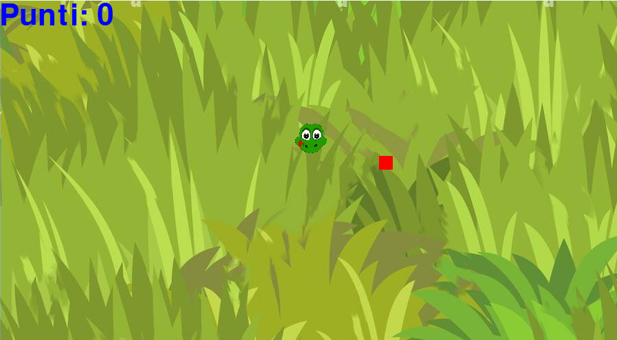

# 🐍 Snake Game


Welcome to **Snake Game**, a simple yet fun game developed in **Python using Pygame**. This project marks the **first milestone in my programming career**, created as part of the final exam for the *Fondamenti di Informatica 1* course.

---

## 🎮 Game Description

The game features a classic Snake-style mechanic:
- Move the snake using arrow keys or **WASD**.
- Eat the red square (apple) to grow your snake.
- Avoid the edges of the screen to stay alive.
- If you hit the wall, it's game over — but you can press **N** to start a new game or **C** to quit.

The score is displayed in the top-left corner and increases with every apple you eat.

---

## 🧱 Project Structure

```text
project-root/
├── snake_game.py           # Main game logic
└── img/
    ├── schermata_iniziale.png    # Starting screen 
    ├── sfondo_erba.jpeg          # Grass background image
    └── testaSnake.png            # Snake head sprite
```

---

## 🛠️ Key Features

- **Smooth Movement** using frame-based updates.
- **Collision Detection** for both apple and game-over conditions.
- **Custom Graphics** using external image files.
- **Score Tracking** with on-screen display.
- **Restart Functionality** after game over.

---

## ▶️ How to Run

1. Make sure you have [Python](https://www.python.org/) and [Pygame](https://www.pygame.org/) installed.
2. Place the required images (`sfondo_erba.jpeg`, `testaSnake.png`) inside an `img/` directory located one level above `snake_game.py`.
3. Run the game:
   ```bash
   python snake_game.py
   ```

---

## 📌 Notes

- This game was developed as my **first-ever coding project**.
- Created for the **Foundations of Computer Science exam**.
- It helped me grasp key programming concepts such as loops, functions, events, and basic object management using `pygame`.

---

## 📷 Preview

Here is the starting screen of the game:



---


